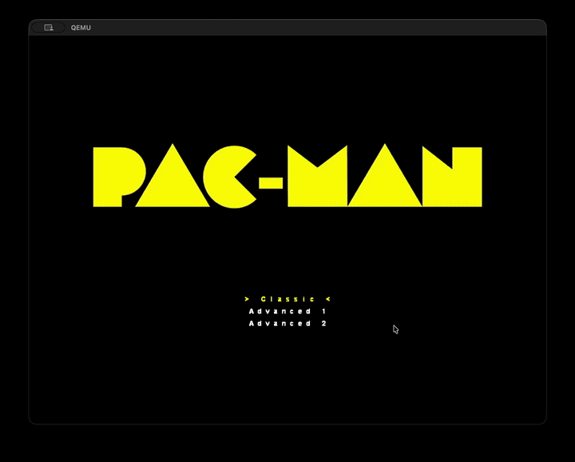
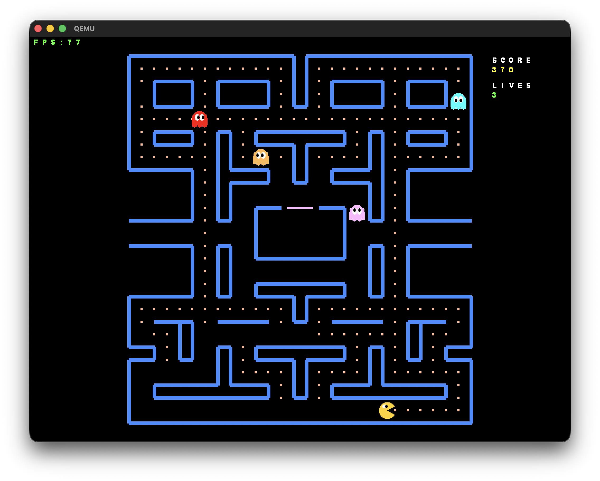
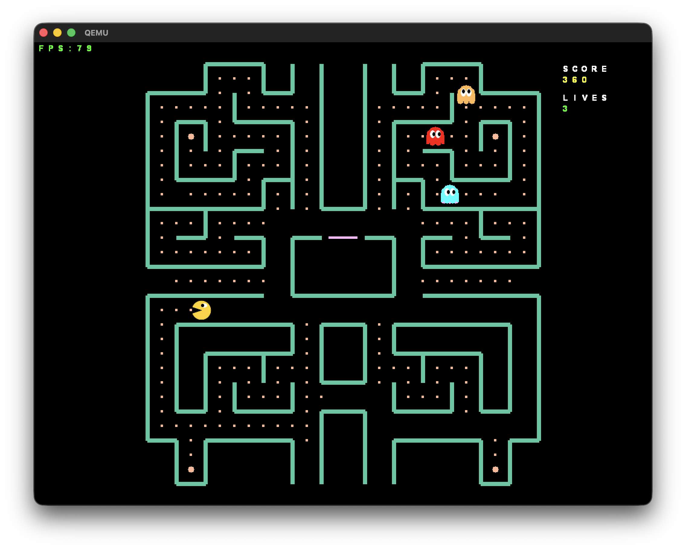
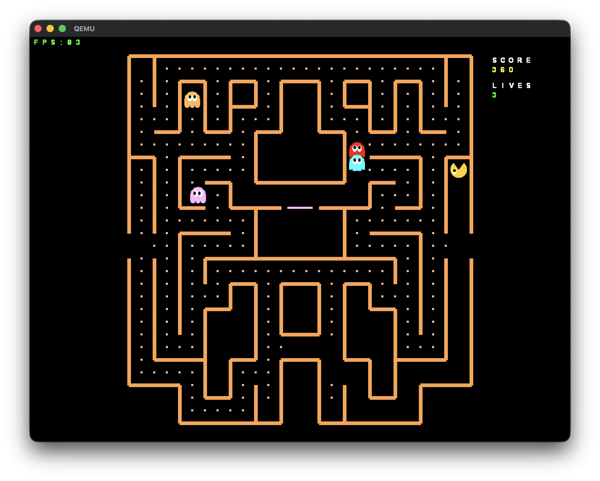
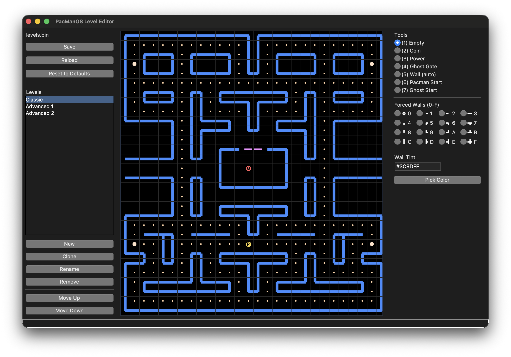

[](https://github.com/mdeclerk/PacManOS/actions/workflows/CI.yml)

# PacManOS

A bare-metal 32-bit x86 kernel that boots straight into a playable Pac-Man clone.



## Getting Started

### Prerequisites

Required:
- Docker
- QEMU
- Python 3 + Tkinter

Optional:
- Bochs
- GDB

### Build and run

```bash
./buildenv.sh init      # Build Docker-based toolchain (one-time)
./buildenv.sh qemu-rel  # Build release ISO and run in QEMU
```

### How to play

- Select a level in main menu with arrow keys and ENTER
- Use arrow keys to make Pac-Man walk
- Use ESC to quit game and go back to main menu

<table><tr>
  <td></td>
  <td></td>
  <td></td>
</tr></table>

### Make your own levels

```bash
./buildenv.sh editor
```

Level data is located in `assets/pacman/levels.bin`.



## Overview

### Project Structure

```text
PacManOS/
├─ src/                    
│  ├─ engineos/            EngineOS module (kernel, engine, public API)
│  ├─ pacman/              Pac-Man game module
│  ├─ editor/              Python/Tkinter Pac-Man level editor
│  ├─ helloworld/          Hello World test game module
│  └─ stdlib/              Freestanding minimal C library
├─ assets/                 
│  ├─ pacman/              Pac-Man assets
│  └─ helloworld/          Hello World assets
├─ mk/                     Make build fragments
├─ bochsrc/                Bochs emulator configs
├─ buildenv.sh             Docker-based build environment helper
├─ Makefile                Top-level Makefile
├─ Dockerfile              Cross-compiler toolchain image
└─ ...
```

### Modularity

PacManOS separates the shared `engineos` layer from individual game modules. `engineos` provides the core OS and engine functionality, while games live in their own modules and plug into that shared layer. This makes the architecture easy to extend, with [`src/helloworld/`](/Users/Q293415/Documents/Repos/personal/PacManOS/src/helloworld) serving as a minimal example of how to add another game module on top of [`src/engineos/`](/Users/Q293415/Documents/Repos/personal/PacManOS/src/engineos).

### Build Script `buildenv.sh` 

```text
usage: ./buildenv.sh <command>

commands:
  init        Build Docker cross-compiler image (one-time)
  bash        Open an interactive shell in the build container
  editor      Launch the level editor

  make-dbg    Build debug ISO
  make-rel    Build release ISO
  clean       Remove build output

  qemu-dbg    Build debug ISO and run in QEMU
  qemu-rel    Build release ISO and run in QEMU
  qemu-gdb    Build debug ISO and run QEMU with GDB stub
  
  bochs-dbg   Build debug ISO and run in Bochs
  bochs-rel   Build release ISO and run in Bochs
```

### Build Artifacts in `out/`

Build artifacts go to `out/debug` or `out/release` respectively.

```text
Components
  src/stdlib/*        -> [libstd.a]
  src/engineos/*      -> [engineos.elf]
  src/<game>/*        -> [<game>.elf]
  assets/<game>/*     -> [<game>.ramfs]

Final Assembly
  [engineos.elf] + [<game>.elf] + [<game>.ramfs] -> [pacmanos.iso]
```
